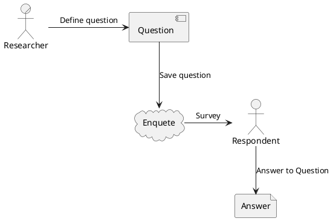
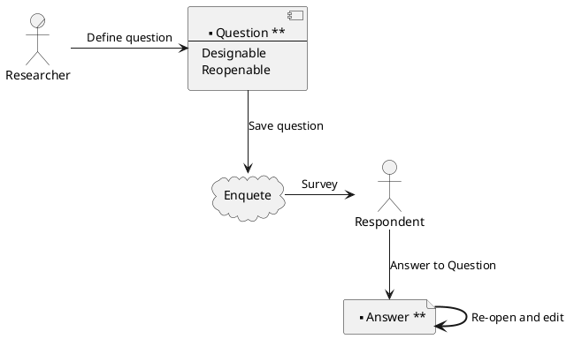

Idea 0: 構想
============

自由度の高いアンケートを作りたい。
* →そうなるとほぼマルチフォーム的なアプリケーションが求められる。
    * [マスト]レイアウトと色、アイコンはカスタマイズしたい
    * [マスト]外部連携の自由度を高めたい
    * 設問は当面一般的なもので十分
        * 選択式：1つ/複数
        * 自由記入
        * 条件付き自由記入：男性のみ回答、とか
        * 後から追加するだろう

基本的な構成
------------

* アンケートを作成して回答を集める
* 基本的な設問形式
    * 選択[単一/複数]
    * テキスト入力(単一行)
        * 電話番号/メール/日付/ID/正規表現/APIによる入力チェック
        * 連動式：郵便番号から住所/IDからユーザ情報/APIによる値取得
    * テキスト入力(複数行)
        * 自由記入/行志向(連続する単一行)/APIによる入力チェック
* 応用的な設問形式
    * ~~マトリックス~~ → 連続する選択でグルーピングする
        * 連続する選択[単一/複数]
    * ファイル[単一 ~~/複数~~]
        * 形式指定→ほとんど画像では？カメラ撮影もある？
* 設問制御
    * 前設問の影響を受ける（非活性）：例）女性の場合、次の質問に～
    * 回答時間
    * 回答数制限
        * 複数選択3つまで ~~/ファイル4つまで~~ /etc

応用的な構成
------------

回答を再度開いて編集または参照すること
    : 入力時のデフォルト値 \
    自動入力項目 \
    編集不可項目（新規入力のみ、編集時は参照）

回答画面のデザイン、レイアウトを自由に変更できること
    : カスタムCSSの仕様を公開するか？

回答画面のドメインを指定されるかも
    : サブドメインで逃げるか？

