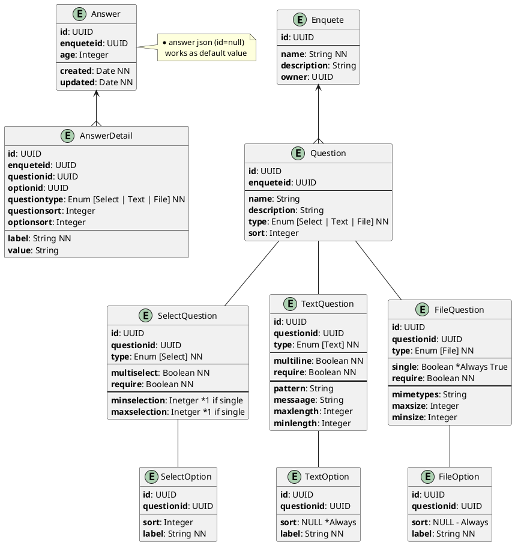

Idea1: データ構造
=================

```plantuml
@startuml
    entity Enquete {
		**id**: UUID
		--
		**name**: String NN
		**description**: String
		**owner**: UUID
		' ==
		' **logourl**: String AS URL
		' **limitsec**: Integer
    }
	' entity QuetionGroup {
    '     **id**: UUID
	' 	**enqueteid**: UUID
	' 	--
	' 	**name**: String
	' 	**sort**: Integer
	' 	' ==
	' 	' **#TODO: style**: String
	' }
    entity Question {
        **id**: UUID
		**enqueteid**: UUID
		' **groupid**: UUID
		--
		**name**: String
		**description**: String
		**type**: Enum [Select | Text | File] NN
		**sort**: Integer
    }
	Enquete <-down-{ Question
	' Enquete <-down-{ QuetionGroup
	' QuetionGroup <-down-{ Question

	entity SelectQuestion {
        **id**: UUID
		**questionid**: UUID
		**type**: Enum [Select] NN
		--
		**multiselect**: Boolean NN
		**require**: Boolean NN
		==
		**minselection**: Inetger *1 if single
		**maxselection**: Inetger *1 if single
		' ==
		' **#TODO: checker**: String AS URL
		' **#TODO: layout**: list, inline
	}
	entity SelectOption {
        **id**: UUID
		**questionid**: UUID
		--
		**sort**: Integer
		**label**: String NN
	}
	Question -- SelectQuestion
	SelectQuestion -- SelectOption

	entity TextQuestion {
        **id**: UUID
		**questionid**: UUID
		**type**: Enum [Text] NN
		--
		**multiline**: Boolean NN
		**require**: Boolean NN
		==
		**pattern**: String
		**messaage**: String
		**maxlength**: Integer
		**minlength**: Integer
		' ==
		' **#TODO: checker**: String AS URL
	}
	entity TextOption {
        **id**: UUID
		**questionid**: UUID
		--
		**sort**: NULL *Always
		**label**: String NN
	}
	Question -- TextQuestion
	TextQuestion -- TextOption

	entity FileQuestion {
        **id**: UUID
		**questionid**: UUID
		**type**: Enum [File] NN
		--
		**single**: Boolean *Always True
		**require**: Boolean NN
		==
		**mimetypes**: String
		**maxsize**: Integer
		**minsize**: Integer
		' ==
		' **#TODO: checker**: String AS URL
		' **#TODO: layout**: camera, d&d
	}
	entity FileOption {
        **id**: UUID
		**questionid**: UUID
		--
		**sort**: NULL - Always
		**label**: String NN
	}
	Question -- FileQuestion
	FileQuestion -- FileOption


	entity Answer {
		**id**: UUID
		**enqueteid**: UUID
		**age**: Integer
		--
		**created**: Date NN
		**updated**: Date NN
	}
	note right
		* answer json (id=null)
		  works as default value
	end note
	entity AnswerDetail {
		**id**: UUID
		**enqueteid**: UUID
		' **groupid**: UUID
		**questionid**: UUID
		**optionid**: UUID
		**questiontype**: Enum [Select | Text | File] NN
		' **groupsort**: Integer
		**questionsort**: Integer
		**optionsort**: Integer
		--
		**label**: String NN
		**value**: String
	}
	Answer <-down-{ AnswerDetail

@enduml
```