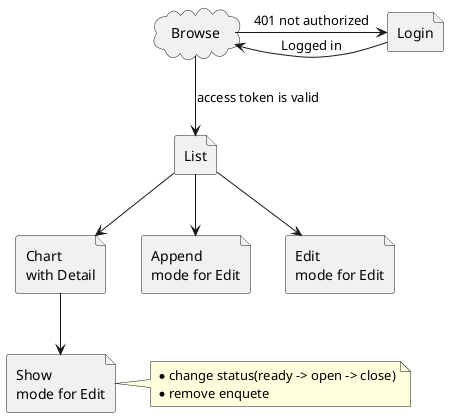

Idea2: 画面構成
=================

```plantuml
@startuml

	cloud Browse
    file Login
    file List
    file Chart [
		Chart
		with Detail
	]
    file Append [
		Append
		mode for Edit
	]
    file Edit [
		Edit
		mode for Edit
	]
    file Show [
		Show
		mode for Edit
	]
	note right
		* change status(ready -> open -> close)
		* remove enquete
	end note

	Browse -right-> Login : 401 not authorized
	Login  -left-> Browse : Logged in
	Browse --> List : access token is valid
	List   --> Append
	List   --> Edit
	List   --> Chart
	Chart  --> Show

@enduml
```